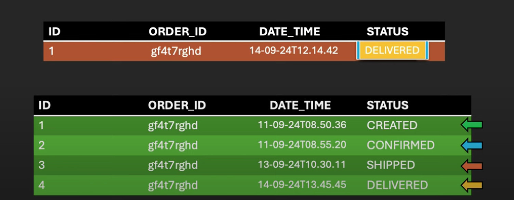
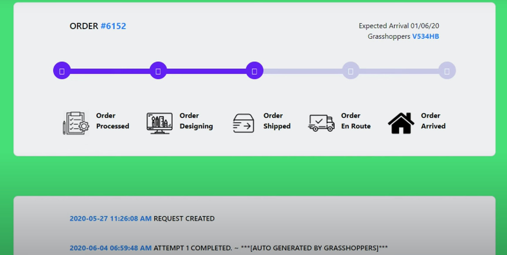
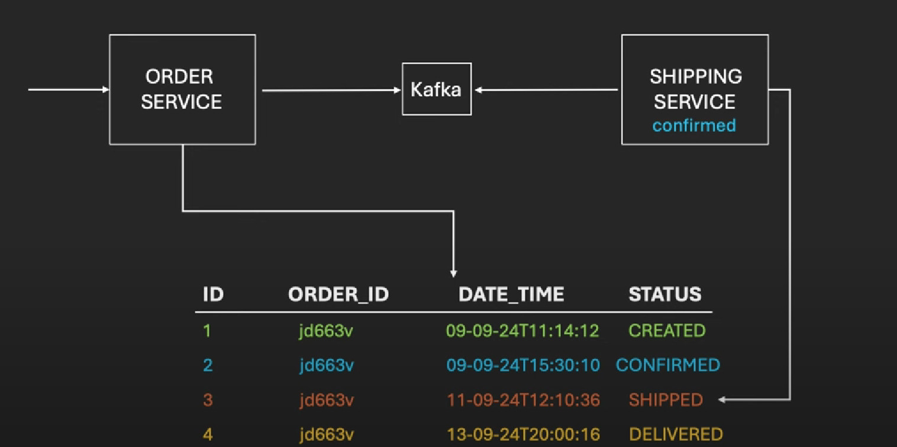
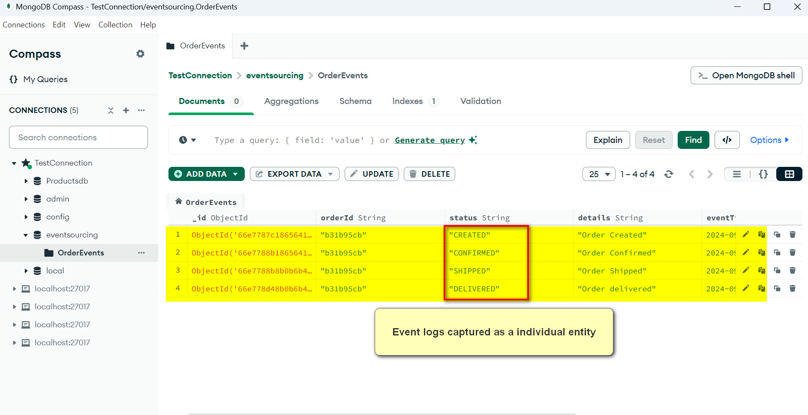

# Event Sourcing Microservices Demonstration

## Overview

This project demonstrates the implementation of an event sourcing strategy using Spring Boot microservices. The example involves two services: `order-service` and `shipping-service`, which manage the lifecycle of an order from creation through shipping and delivery.

## What is Event Sourcing?

Event sourcing is an architectural pattern where all changes to application state are stored as a sequence of events. Instead of only saving the current state of data in a domain, event sourcing also saves each state change as an event which can be replayed to reconstruct past states or the entire entity.

## Importance of Event Sourcing

Event sourcing ensures that all changes to the application state are captured in an event log, which acts as a record of all actions. This allows for accurate auditing, troubleshooting, and replaying of events to restore or predict system states.

## Challenges Without Event Sourcing

Traditional systems often update the database with the latest status of entities such as orders, losing the history of previous states in the process. For instance, if an order moves through states `CREATED`, `CONFIRMED`, `SHIPPED`, and `DELIVERED`, only the current state is retained. If a need arises to analyze the transition or revert to a previous state due to an error or complaint, this information is unavailable, impacting business operations and customer satisfaction.


## Why Choose Event Sourcing?

Event sourcing addresses these challenges by maintaining a log of all state changes. This not only allows for recovering previous states but also aids in debugging and understanding the sequence of actions that led to a particular state.




## Example website of this pattern




## Our Demo Application Design




## Creating Order Microservice (`order-service`)

### Overview
The `order-service` handles the creation and confirmation of orders. It publishes events to a Kafka topic that the shipping service can consume.

### Dependencies
- Spring Boot Web
- Spring Boot Data MongoDB
- Spring Kafka
- Lombok
- Spring Boot Devtools

### Configuration Highlights
```yaml
spring:
  application:
    name: order-service
  kafka:
    template:
      default-topic: order-events
server:
  port: 8081
```

### Kafka Producer Settings
```yaml
spring:
  kafka:
    producer:
      key-serializer: org.apache.kafka.common.serialization.StringSerializer
      value-serializer: org.springframework.kafka.support.serializer.JsonSerializer
```

Serialization Details
  - Key Serializer: Uses `StringSerializer` to convert keys into strings, suitable for Kafka's message keys.
  - Value Serializer: Uses `JsonSerializer` to convert order data objects into JSON formatted strings, enabling efficient transmission of complex data structures over the network. This is crucial for ensuring the data integrity and compatibility of messages sent to Kafka topics that are consumed by other services.

## APIs and Their Functions
- **POST `/orders/create`**: Creates a new order and publishes an event.
- **PUT `/orders/confirm/{orderId}`**: Confirms an order and publishes an event.

## Significance of Kafka as a Publisher
Kafka is used to publish order events which the shipping service listens to. This decouples the order processing and shipping processes and allows the shipping service to react to order confirmations.

## Creating Shipping Microservice (`shipping-service`)

### Overview
The `shipping-service` listens for confirmed orders from the `order-service` and handles the shipping and delivery processes.

### Dependencies
Identical to `order-service`, focusing on Kafka listeners and MongoDB for data persistence.

### Configuration Highlights
```yaml
spring:
  kafka:
    consumer:
      group-id: shipping-service
server:
  port: 8082
```

### Kafka Consumer Settings
```yaml
spring:
  kafka:
    consumer:
      key-deserializer: org.apache.kafka.common.serialization.StringDeserializer
      value-deserializer: org.springframework.kafka.support.serializer.ErrorHandlingDeserializer
      properties:
        spring.deserializer.key.delegate.class: org.apache.kafka.common.serialization.StringDeserializer
        spring.deserializer.value.delegate.class: org.springframework.kafka.support.serializer.JsonDeserializer
        spring.json.trusted.packages: '*'
```

Deserialization Details:
  - Key Deserializer: Utilizes `StringDeserializer` for converting message keys back from strings.
  - Value Deserializer: Employs `ErrorHandlingDeserializer` which wraps `JsonDeserializer`. This setup not only converts JSON strings back into order event objects but also manages errors during this process effectively. Specifying `spring.json.trusted.packages: '*'` indicates that JSON from any package can be deserialized. For increased security, restrict this to specific packages related to your data classes to avoid potential vulnerabilities from untrusted sources.

## APIs and Their Functions
- **POST `/shipping/ship/{orderId}`**: Automatically triggered by Kafka listener on order confirmation to ship an order.
- **POST `/shipping/deliver/{orderId}`**: Manually triggers the delivery of an order.

## Significance of Kafka as a Listener
Kafka is crucial for enabling the `shipping-service` to listen for events published by `order-service`, ensuring that shipping actions are based on real-time data and are fully automated.


## How to Test

### Prerequisites
Start MongoDB, Zookeeper, and Kafka. For setup instructions, see [notes.txt](/order-service/notes.txt).

### Steps to Test
1. Start both microservices.
2. Use Postman to simulate API calls:
   - **Create an order:**
     ```json
     POST http://localhost:8081/orders/create
     {
       "orderId": "ORD1234",
       "name": "Mobile",
       "qty": 3,
       "price": 599.99,
       "userId": "USR93455"
     }
     ```
   - **Confirm the order:**
     ```json
     PUT http://localhost:8081/orders/confirm/b31b95cb
     ```
   - **Ship the order:**
     The order is automatically shipped when confirmed, as handled by the Kafka listener within the `shipping-service`. This is triggered by the order status being updated to `CONFIRMED`.
   - **Deliver the order:**
     ```json
     POST http://localhost:8082/shipping/deliver/b31b95cb
     ```
     Response: `Order delivered successfully.`

## MongoDB 

Here you can see the events logging as a seperate record based on the update for an order.


